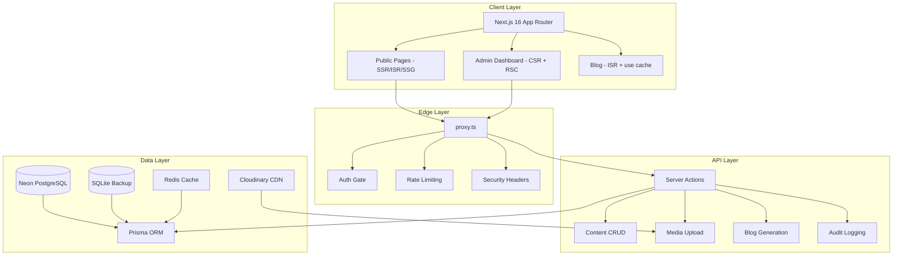

# LakeViewVilla — Premium Redesign & Dashboard Integration

Complete redesign of the LakeViewVilla web app into a premium, hyper-performant, content-managed platform with admin dashboard, AI blog, and superior SEO.

## User Review Required

> [!IMPORTANT]
> This plan covers **8 major phases** across Frontend, Backend, Database, DevOps, SEO, Security, and Performance domains. Each phase is designed to be independently verifiable. Please review the proposed architecture and flag any changes before implementation begins.

> [!WARNING]
> **Breaking Changes:** This redesign will migrate from `middleware.ts` → `proxy.ts` (Next.js 16), restructure all section components, introduce Prisma + Neon DB, and add a full `/admin` route group. The public-facing site will be rebuilt section-by-section to maintain deployment continuity.

## Open Questions

> [!IMPORTANT]
> 1. **Database Provider:** Plan uses Neon PostgreSQL (primary) + SQLite (fallback/backup). Is Neon confirmed, or do you prefer MongoDB Atlas?
> 2. **Auth Provider:** Plan uses NextAuth.js v5 with credentials + OAuth. Do you want Clerk or another provider instead?
> 3. **AI Blog Model:** Plan uses OpenRouter free models (e.g., `mistralai/mistral-7b-instruct`). Confirm preferred model or provider.
> 4. **Cloudinary:** Plan uses Cloudinary for media. Do you have an existing account/API key, or should we evaluate alternatives like UploadThing?
> 5. **Domain:** Is `lakeviewvillatangalle.com` the only production domain for CI/CD health checks?

---

## Architecture Overview



---

## Proposed Changes

### Phase 1: Foundation & Configuration (Week 1)

Core infrastructure, build config, and design system setup.

---

#### [MODIFY] [next.config.mjs → next.config.ts](file:///g:/@Valorem/@Web/LakeViewVilla/next.config.mjs)

Migrate to TypeScript config. Enable Next.js 16 features:
- `cacheComponents: true` — explicit `"use cache"` directive support
- `reactCompiler: true` — automatic memoization (eliminates manual useMemo/useCallback)
- Turbopack filesystem cache for dev: `turbopackFileSystemCacheForDev: true`
- Remove deprecated webpack-specific configs
- Retain security headers, image domains, CSP

#### [NEW] proxy.ts

Replace `middleware.ts` with Next.js 16 `proxy.ts`:
- Node.js runtime (not Edge-only)
- Auth session verification for `/admin/*` routes
- Rate limiting headers
- Security header injection
- Matcher config to skip `_next/static`, `_next/image`, `favicon.ico`

#### [NEW] lib/gsap.ts

Centralized GSAP + ScrollTrigger + Lenis registration:
- Single import point to prevent re-registration on HMR
- `ScrollTrigger.register()` once
- Lenis sync: `lenis.on("scroll", ScrollTrigger.update)`
- GSAP ticker drives Lenis RAF: `gsap.ticker.add((time) => lenis.raf(time * 1000))`

#### [MODIFY] [globals.css](file:///g:/@Valorem/@Web/LakeViewVilla/app/globals.css)

Extend design tokens:
- Add `--ease-premium: cubic-bezier(0.16, 1, 0.3, 1)` and motion timing tokens
- Add WCAG AAA contrast-validated color pairs
- Add scroll-driven animation CSS custom properties
- Add admin dashboard theme tokens (sidebar, cards, inputs)
- Retain all existing tokens for backwards compatibility

#### [MODIFY] [tailwind.config.ts](file:///g:/@Valorem/@Web/LakeViewVilla/tailwind.config.ts)

Add dashboard utilities, animation keyframes, container queries.

#### [MODIFY] [package.json](file:///g:/@Valorem/@Web/LakeViewVilla/package.json)

Add dependencies:
- `prisma`, `@prisma/client` — ORM
- `@auth/prisma-adapter`, `next-auth@5` — Auth
- `@neondatabase/serverless` — DB driver
- `cloudinary`, `next-cloudinary` — Media
- `better-sqlite3` — Backup DB
- `@tanstack/react-query` — Client data cache
- `react-dropzone` — File upload
- `openai` (OpenRouter-compatible) — AI blog
- `csv-parse`, `csv-stringify` — Data import/export

---

### Phase 2: Database & Auth (Week 1-2)

Data layer, authentication, and RBAC.

---

#### [NEW] prisma/schema.prisma

Full schema with models:
- `User` (id, email, passwordHash, role: DEVELOPER|MANAGER|EDITOR, avatar, createdAt)
- `Session`, `Account`, `VerificationToken` (NextAuth)
- `MediaAsset` (id, url, publicId, type, category, tags[], order, metadata, pageAssignment, sectionAssignment, uploadedById, createdAt)
- `ContentBlock` (id, pageSlug, sectionSlug, order, data:Json, version, publishedAt)
- `BlogPost` (id, title, slug, content, excerpt, featuredImageId, authorId, status: DRAFT|PUBLISHED|ARCHIVED, seoMeta:Json, tags[], generatedByAI, createdAt, updatedAt, publishedAt)
- `AuditLog` (id, userId, action, entityType, entityId, oldValue:Json, newValue:Json, ipAddress, timestamp)
- `Setting` (key, value:Json) — for site config

#### [NEW] lib/db/prisma.ts

Prisma client singleton with connection pooling for serverless.

#### [NEW] lib/db/sqlite-backup.ts

SQLite fallback sync engine:
- Readonly mode when Neon unavailable
- Background sync to Neon when connection restores
- Audit logs write to SQLite first, then sync

#### [NEW] lib/auth/config.ts

NextAuth v5 configuration:
- Credentials provider (email + password with bcrypt)
- Session strategy: JWT
- Role-based callbacks (attach role to session)
- Custom sign-in/sign-out pages at `/admin/login`

#### [NEW] lib/auth/rbac.ts

Role-Based Access Control:
- `DEVELOPER`: Full access (all CRUD, audit logs, settings, import/export, user management)
- `MANAGER`: Content CRUD, media management, blog management (no audit logs, no user management)
- `EDITOR`: Content editing only, media upload (no delete, no settings, no user management)
- Helper: `requireRole(session, minimumRole)` guard function

#### [NEW] app/admin/login/page.tsx

Secure login page:
- Callback URL support (redirect back after auth)
- Form persistence (email remembered)
- Error feedback with toast
- Redirect to `/admin` if already authenticated

---

### Phase 3: Admin Dashboard (Week 2-3)

Full-featured content management system.

---

#### [NEW] app/admin/layout.tsx

Dashboard shell:
- Sidebar navigation (collapsible, responsive)
- Header with user avatar, role badge, logout
- Theme toggle (dark/light, inherits site theme tokens)
- Breadcrumbs
- Protected by `proxy.ts` auth gate

#### [NEW] app/admin/page.tsx

Dashboard home:
- Stats overview cards (total media, blog posts, recent activity)
- Quick actions (upload media, new blog post)
- Recent audit log entries (DEVELOPER only)

#### [NEW] app/admin/media/page.tsx + components

Media management:
- Grid/list view toggle with category filters (all, indoor, outdoor, kitchen, bedroom-1, bedroom-2, bathroom, with-guests, featured, new)
- Multi-file upload with `react-dropzone` (drag & drop)
- URL-based upload (fetch from URL, preview, then upload to Cloudinary)
- File type validation (images: webp/jpg/png/avif, videos: mp4/webm, PDFs)
- Live upload preview with progress bars
- Zoomable image/video/PDF preview modal
- Drag-and-drop order reordering (saves to DB)
- Tag management (per-asset tags, page/section assignment with limits + preview + confirmation)
- Bulk operations (delete, re-categorize, re-tag)
- Cloudinary integration for storage, transformation, CDN delivery

#### [NEW] app/admin/content/page.tsx + components

Content management:
- Page-level content blocks editor
- Section ordering with drag-and-drop
- Live preview pane (shows how section looks on site)
- Form persistence (auto-save drafts to localStorage + DB)
- Version history per content block
- Quick-add mode (minimal form for rapid content entry)
- Inline help tooltips

#### [NEW] app/admin/blog/page.tsx + components

Blog management:
- Blog post list with status filters (draft/published/archived)
- Rich text editor (MDX or Tiptap)
- AI blog generation: user uploads image + writes brief → calls OpenRouter → generates full post
- Manual writing mode with undo/redo history (persisted in state)
- If AI accidentally overwrites manual content → undo stack restores it
- SEO metadata editor per post (title, description, keywords, OG image, schema)
- Featured image from media library
- Publish/unpublish/schedule workflow
- Blog preview page

#### [NEW] app/admin/users/page.tsx (DEVELOPER only)

User management:
- CRUD for admin users
- Role assignment (DEVELOPER, MANAGER, EDITOR)
- Activity log per user

#### [NEW] app/admin/audit/page.tsx (DEVELOPER only)

Audit log viewer:
- Filterable by user, action, entity type, date range
- Export to CSV
- Stored in SQLite backup → synced to Neon

#### [NEW] app/admin/settings/page.tsx (DEVELOPER only)

Site settings:
- Data import/export (CSV format for media metadata, content blocks, blog posts)
- Dynamic data structure viewer
- Backup database status and manual sync trigger
- Site configuration (WhatsApp number, booking links, Google Maps, social links)

---

### Phase 4: Premium UI/UX Redesign (Week 3-4)

Complete visual overhaul of all public-facing pages.

---

#### [NEW] components/motion/lenis-provider.tsx

Global smooth scroll provider:
- Lenis instance with `autoRaf: false` (GSAP drives RAF)
- `syncTouch: true` for mobile
- `prefers-reduced-motion` respect
- Context provider for child access

#### [NEW] components/motion/scroll-reveal.tsx

Premium scroll reveal wrapper (replaces current `section-reveal.tsx`):
- GSAP ScrollTrigger-powered
- Configurable: fade-up, fade-in, slide-left/right, scale, blur-in
- Stagger support for child elements
- `useGSAP` hook with proper scope + cleanup
- Intersection Observer fallback for reduced-motion

#### [MODIFY] [components/sections/hero.tsx](file:///g:/@Valorem/@Web/LakeViewVilla/components/sections/hero.tsx)

Premium hero redesign:
- GSAP ScrollTrigger pinned hero with parallax layers
- Text reveal animations (clip-path, split-text character animation)
- Cross-fade between hero images on scroll (using `--hero-xfade` CSS variable)
- Improved from ValoremDistress reference: better timeline sync, GPU-only transforms, reduced DOM manipulation
- Ken Burns on idle, scroll-driven parallax on scroll
- Mobile: simplified animation, no pinning, reduced layers

#### [MODIFY] [components/sections/highlights.tsx](file:///g:/@Valorem/@Web/LakeViewVilla/components/sections/highlights.tsx)

- Staggered card reveal on scroll
- Hover: magnetic tilt effect (GPU-accelerated transform only)
- Glass card design with theme-aware opacity

#### [MODIFY] [components/sections/experiences-reel.tsx](file:///g:/@Valorem/@Web/LakeViewVilla/components/sections/experiences-reel.tsx)

- Horizontal scroll section with GSAP ScrollTrigger pin
- Parallax image layers within each card
- Improved from ValoremDistress `HomeServicesSection`: use GSAP instead of motion/react for better scroll sync

#### [MODIFY] [components/sections/gallery-teaser.tsx](file:///g:/@Valorem/@Web/LakeViewVilla/components/sections/gallery-teaser.tsx)

- Masonry/staggered grid with scroll-driven reveal
- Image zoom on hover with smooth spring easing
- "View Gallery" CTA with magnetic button effect

#### [MODIFY] [components/sections/stays-teaser.tsx](file:///g:/@Valorem/@Web/LakeViewVilla/components/sections/stays-teaser.tsx)

- Card flip/expand animation on interaction
- Price reveal with counter animation
- Booking CTA with pulse/glow effect

#### [MODIFY] [components/sections/facilities.tsx](file:///g:/@Valorem/@Web/LakeViewVilla/components/sections/facilities.tsx)

- Icon grid with staggered fade-in
- Hover: icon bounce + tooltip with facility details
- Responsive: 2-col mobile → 4-col desktop

#### [MODIFY] [components/sections/values.tsx](file:///g:/@Valorem/@Web/LakeViewVilla/components/sections/values.tsx)

- Scroll-driven number counter animations
- Parallax background texture
- Text reveal with blur-to-sharp effect

#### [MODIFY] [components/sections/faq.tsx](file:///g:/@Valorem/@Web/LakeViewVilla/components/sections/faq.tsx)

- Accordion with smooth height animation (GSAP, not CSS max-height)
- Search/filter functionality
- Schema markup for FAQ rich results

#### [MODIFY] [components/sections/map-directions.tsx](file:///g:/@Valorem/@Web/LakeViewVilla/components/sections/map-directions.tsx)

- Lazy-loaded map with intersection observer
- Directions card with glass effect
- Scroll reveal animation

#### [MODIFY] [components/layout/navigation.tsx](file:///g:/@Valorem/@Web/LakeViewVilla/components/layout/navigation.tsx)

- Scroll-aware: transparent → glass on scroll
- Mobile: bottom sheet menu with spring animation
- Active section indicator synced with ScrollTrigger
- Theme toggle with smooth icon morph

#### [MODIFY] [components/layout/footer.tsx](file:///g:/@Valorem/@Web/LakeViewVilla/components/layout/footer.tsx)

- Parallax reveal on scroll into view
- Link hover animations
- Newsletter/contact CTA

#### [MODIFY] [components/layout/below-fold.tsx](file:///g:/@Valorem/@Web/LakeViewVilla/components/layout/below-fold.tsx)

- Wrap each section with `ScrollReveal` component
- Dynamic imports with proper Suspense boundaries
- `"use cache"` directive for static content blocks

#### [NEW] app/blog/page.tsx

Blog listing page:
- Grid of blog post cards with scroll-reveal stagger
- Category/tag filtering
- Pagination with ISR
- SEO: BlogPosting schema per post

#### [NEW] app/blog/[slug]/page.tsx

Individual blog post:
- Rich content rendering (MDX)
- Table of contents with scroll-spy
- Related posts section
- Social sharing
- Full SEO metadata (Article schema, OG tags, breadcrumbs)

---

### Phase 5: Performance Optimization (Week 4)

Hyper-performance tuning for Core Web Vitals.

---

#### Rendering Strategy

| Page | Strategy | Cache |
|------|----------|-------|
| `/` (Home) | ISR (revalidate: 3600) + `"use cache"` for content blocks | Redis + CDN |
| `/gallery` | ISR (revalidate: 1800) | CDN |
| `/stays` | ISR (revalidate: 3600) | CDN |
| `/visit` | SSG (static) | CDN |
| `/faq` | ISR (revalidate: 86400) | CDN |
| `/blog` | ISR (revalidate: 600) | CDN |
| `/blog/[slug]` | ISR (revalidate: 3600) | CDN |
| `/admin/*` | CSR + RSC (dynamic, no cache) | None |
| `/developer` | SSG | CDN |

#### Resource Optimization

- `"use cache"` + `cacheLife("hours")` for content blocks served from DB
- `cacheTag("media", "blog")` for targeted invalidation on admin updates
- React Query for admin dashboard data (deduplication, background refetch)
- Redis cache layer between Prisma and API for public pages
- Image optimization: Cloudinary transformations (auto format, quality, responsive sizes)
- Font subsetting: only Latin subset, `display: "swap"`
- Critical CSS inlining for above-fold content

#### Bundle Optimization

- Dynamic imports for all below-fold sections
- Direct imports (no barrel exports in app code)
- Tree-shake unused Mantine components
- GSAP: import only ScrollTrigger plugin (not full suite)

---

### Phase 6: SEO & Search Everywhere Optimization (Week 4-5)

---

#### [MODIFY] [app/layout.tsx](file:///g:/@Valorem/@Web/LakeViewVilla/app/layout.tsx)

- Enhanced JSON-LD graph (LodgingBusiness + Organization + WebSite + SiteNavigationElement)
- Add `SpeakableSpecification` schema for voice search (VSO)
- Add `llms.txt` and `llms-full.txt` for AI crawler optimization (GEO/LLMO/AEO)

#### [NEW] app/robots.ts

Dynamic robots.txt:
- Allow GPTBot, Claude-Web, PerplexityBot (GEO)
- Sitemap reference
- Disallow `/admin/*`

#### [NEW] app/sitemap.ts

Dynamic XML sitemap:
- All public pages + blog posts
- `lastmod` from DB timestamps
- Priority and changefreq per page type

#### Per-Page SEO

- Every page: unique `<title>`, `<meta description>`, canonical, OG/Twitter cards
- Blog posts: Article schema, author Person schema, FAQ schema if applicable
- Gallery: ImageGallery schema
- Stays: Product/Offer schema with pricing

#### Content-Level Metadata (Dashboard)

- Admin can set per-content-block: alt text, title, description, keywords
- Auto-generated suggestions from AI (optional)
- Schema markup auto-generated from content type

---

### Phase 7: Security Hardening (Week 5)

---

#### Security Measures

- **CSP**: Strict Content-Security-Policy (retain existing + add admin routes)
- **CSRF**: Server action CSRF tokens
- **Rate Limiting**: In `proxy.ts` — 100 req/min for API, 10 req/min for auth
- **Input Validation**: Zod schemas on all server actions
- **File Upload Security**: Type validation, size limits, Cloudinary virus scanning
- **Password Security**: bcrypt with salt rounds ≥ 12
- **Session Security**: JWT with short expiry + refresh tokens
- **SQL Injection**: Prisma parameterized queries (ORM protection)
- **XSS**: React's built-in escaping + CSP
- **Dependency Audit**: `npm audit` in CI pipeline

---

### Phase 8: CI/CD & DevOps (Week 5)

---

#### [NEW] .github/workflows/ci.yml

CI pipeline (reference: distress CI):
- Trigger: push to `main`, `dev`; PRs to `main`
- Concurrency group with cancel-in-progress
- Steps: Checkout → Node 24 setup → `npm ci` → Security audit → Lint → Type check → Build
- Next.js build cache

#### [NEW] .github/workflows/lighthouse.yml

Lighthouse CI:
- Trigger: PR to `main`
- Run Lighthouse on preview URL
- Assert: LCP < 2.5s, INP < 200ms, CLS < 0.1
- Comment results on PR

#### [NEW] .github/workflows/dependency-review.yml

Dependency security:
- Trigger: PR
- `github/dependency-review-action`
- Block PRs with high/critical vulnerabilities

---

## Verification Plan

### Automated Tests

```bash
# Type checking
npx tsc --noEmit

# Linting  
npm run lint

# Build verification
npm run build

# Lighthouse audit (after deploy)
npx lighthouse https://lakeviewvillatangalle.com --output json
```

### Manual Verification

1. **UI/UX**: Browser test all pages at 375px, 768px, 1024px, 1440px
2. **Animations**: Verify smooth scroll, scroll-driven animations, reduced-motion compliance
3. **Dashboard**: Test all CRUD operations, file uploads, RBAC permissions
4. **Blog**: Test AI generation, manual writing, undo/redo
5. **Performance**: Lighthouse score ≥ 95 on all categories
6. **SEO**: Validate structured data with Google Rich Results Test
7. **Security**: Test auth flow, CSRF protection, rate limiting
8. **Accessibility**: axe-core audit, keyboard navigation, screen reader test

### Agent Execution Plan

| Phase | Agents | Model |
|-------|--------|-------|
| 1. Foundation | `backend-specialist`, `frontend-specialist` | Claude Opus 4.6 |
| 2. Database & Auth | `database-architect`, `security-auditor`, `backend-specialist` | Claude Sonnet 4.6 |
| 3. Dashboard | `frontend-specialist`, `backend-specialist` | Gemini 3.1 Pro (High) |
| 4. UI/UX Redesign | `frontend-specialist`, `performance-optimizer` | Claude Opus 4.6 |
| 5. Performance | `performance-optimizer`, `backend-specialist` | Gemini 3.1 Pro (High) |
| 6. SEO | `seo-specialist`, `frontend-specialist` | Gemini 3.1 Pro (Low) |
| 7. Security | `security-auditor`, `penetration-tester` | Claude Sonnet 4.6 |
| 8. CI/CD | `devops-engineer`, `test-engineer` | Gemini 3.1 Pro (Low) |
